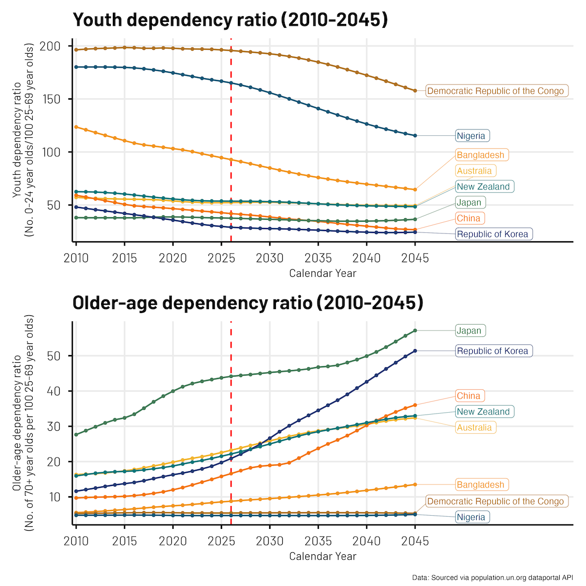
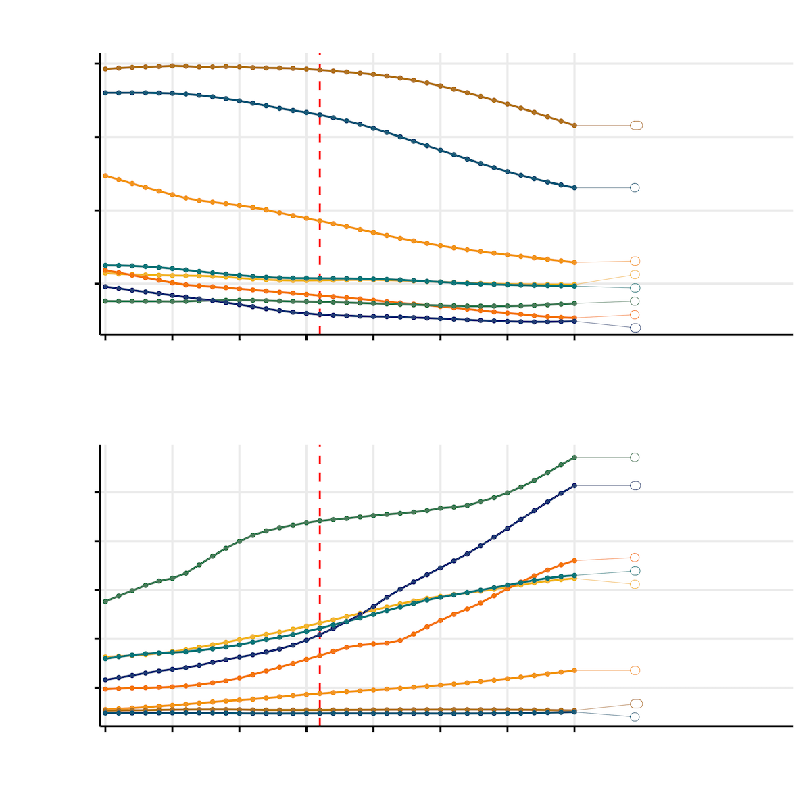
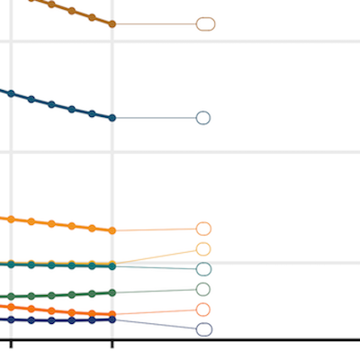
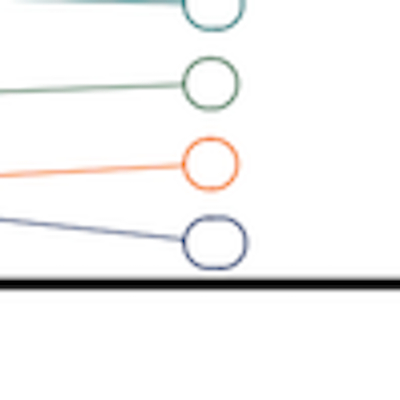

```{r echo=TRUE}
library(thekidsbiostats) # install with install.packages("thekidsbiostats", repos = "the-kids-biostats.r-universe.dev")
```

# Overview

The [United Nations Population Division](https://www.un.org/development/desa/pd/), in addition to doing really [important](https://www.un.org/development/desa/pd/sites/www.un.org.development.desa.pd/files/undesa_pd_2025_technical-paper_dhs-impact.pdf) and [interesting](https://www.un.org/development/desa/pd/sites/www.un.org.development.desa.pd/files/undesa_pd_2026_world_population_highlights-youth_2026_key_messages.pdf) work, also make a lot of robustly collected and compiled [data](https://www.un.org/development/desa/pd/data-landing-page) available to the public. Conveniently, this can be source from their [data portal api](https://population.un.org/dataportalapi/index.html) - one you have [requested](https://population.un.org/dataportalapi/token/index.html) and received a token.

Recently, we sourced data on population estimates (and predictions) to do another one of our 'Guess That Plot' posts at our Institute[(as described in a previous post)](https://the-kids-biostats.github.io/posts/2025-10-10_AIHW_api/aihw_api_guess_plot.html). Let's have a quick look at the code to source the data, and of course the plot!

# Sneak peak - The final plot

Here is the final plot we came up with. It shows the ratio of Youth (0-24 year olds) and Older-age folk (70+ year olds) to *'working age'* (25-69 year olds) folks for a range of (selected) countries, across a 35 year period (2010-2045). 

{#fig-source width="100%" align="center"}

::: {.callout-important}
## Notes

- The age groups selected need to be considered when interpretting the plot. Many people are productively working well before the age of 25 years, more so in certain countries? Likewise, being 70+ years of age in different countries may be characterised by different health and wellbeing profiles.
- Some countries demographic profile will look very different in 2045 compared to 2010 (some near 2-fold (up and down) changes observed).
- We're only ~15 months off being closer to 2045 than 20... I won't go there!

:::

# Sourcing the data

## Step 1: Set-up

The following code was saved into a file called `un_data_source_helper.R` and sourced into the main script. It was created with the assistance of ai and simply does the heavy lifting of working through multiple pages if there is a lot of data.

```{r echo = T, eval = F}
callAPI <- function(relative_path, topics_list = FALSE){
  base_url <- "https://population.un.org/dataportalapi/api/v1"
  target <- paste0(base_url, relative_path)
  pull_url <- getURL(target, .opts=list(httpheader = headers, followlocation = TRUE))
  response <- fromJSON(pull_url)
  # Checks if response was a flat file or a list (indicating pagination)
  # If response is a list, we may need to loop through the pages to get all of the data
  if (class(response)=="list"){
    # Create a dataframe from the first page of the response using the `data` attribute
    df <- response$data
    while (!is.null(response$nextPage)){
      corrected_url <- sub("^.*?/v1", base_url, response$nextPage)
      pull_url <- getURL(corrected_url, .opts=list(httpheader = headers, followlocation = TRUE))
      response <- fromJSON(pull_url)
      df_temp <- response$data
      df <- rbind(df, df_temp)
    }
    return(df)}
  # Otherwise, we will simply load the data directly from the API into a dataframe
  else{
    if (topics_list==TRUE){
      df <- fromJSON(target, flatten = TRUE)
      return(df[[5]][[1]])
    }
    else{
      df <- fromJSON(target)        
      return(df)
    }
  }
}
```

Next, we run the following code to work out what data we want/need.

```{r echo = T, eval = F}
library(jsonlite)
library(httr)
library(RCurl)

headers = c("Authorization" = "Bearer XXXXXXXXX") # add your tokden here
source("un_data_source_helper.R")

# Source indicator codes
indicators <- callAPI("/indicators/") # 298 locations

# Step 1 - Pull all countries
locations <- callAPI("/locations/") # 298 locations

# Step 2 - Pull all country codes
country_codes <- as.character(locations$id)
country_codes <- paste(country_codes, collapse = ",")

# Step 3 - Pull all countries populations (2024)
target <- paste0("/data/indicators/",49,"/locations/",country_codes,"?startYear=2024&endYear=2024&variants=4&sexes=3&pagingInHeader=false&format=json")
population <- callAPI(target)

# Step 4 - Pull the top 15 countries - plus Australia and New Zealand
population |> 
  select(locationId, location, locationTypeId, timeLabel, sex, ageLabel, value,
         variant) |> 
  filter(sex == "Both sexes",
         variant == "Median",
         locationTypeId == 4) %>% 
  arrange(-value) %>% 
  slice_head(n = 15) -> top15

plot_ids <- c(top15 |> pull(locationId), 554, 36, 410)
plot_ids <- paste(plot_ids, collapse = ",")
```

Not all the code is needed, but essentially what we're doing here is.

- pulling into a data frame, a table of the indicators | these are the variables and we need to know the IDs for the data we want
- pulling into a data frame, a table of the locations | we want to request the data for a limited number of locations (countries) to reduce the size of the data request, so we need to know the IDs for those countries
- pulling the current population size for all countries | a quick way to find the IDs for the larger countries, as I knew we wanted to explore some of the larger countries data
- viewing (filtering, arranging etc) the population size data and creating a vector of the IDs | self explantory

## Step 2: Running the API call

Now we know what we want, let's go get it!

We are essentially finding our data here:

`/data/indicators/",83,"/locations/",plot_ids,"?startYear=2010&endYear=2045&startAge=24&endAge=2569&variants=4&sexes=3&pagingInHeader=false&format=json`

::: {.callout-important}
Note - we are not calculating the ratios from the population estimates, the ratios are a calculated statistics we can extract directly, thus avoiding all of the `x/y` stuff!
:::

I'm no API wizard, but I don't think this is too hard to follow! It is essentially a range of filtering criteria joined together with the `&` symbol.

- `startYear=2010&endYear=2045` the window of years we would like `&`
- `startAge=24&endAge=2569` these relate to the numerator and denominator boundaries we are interested in, there are different ratios available for different numerator and denominatory boundaries and combindations `&` 
- `variants=4` we just want the median estimate, otherwise we would also get lower and upper bounds of the estimates `&` 
- `sexes=3` both sexes combined, otherwise we would get 3x the output (male, female, combined).

```{r echo = T, eval = F}
target = paste0("/data/indicators/",83,"/locations/",plot_ids,"?startYear=2010&endYear=2045&startAge=24&endAge=2569&variants=4&sexes=3&pagingInHeader=false&format=json")
system.time(dat_cdep <- callAPI(target))

target = paste0("/data/indicators/",84,"/locations/",plot_ids,"?startYear=2010&endYear=2045&startAge=70&endAge=2569&variants=4&sexes=3&pagingInHeader=false&format=json")
system.time(dat_odep <- callAPI(target))

# Here we source the Total Dependency Ratio data, this wasn't included in the final plotting
target = paste0("/data/indicators/",86,"/locations/",plot_ids,"?startYear=2010&endYear=2045&startAge=2470&endAge=2569&variants=4&sexes=3&pagingInHeader=false&format=json")
system.time(dat_tdep <- callAPI(target))

save.image(paste0(Sys.Date(), "_post_popun_api.Rdata"))
```

And that's it!

# Generating the plot

So now we plot.

First, a little bit of data tidying work was required:

- select only the variables we need, filter down our country list, because we like to be nice to ggplot by only giving it what it needs
- to add the country labels to the plot, we identify the `y-axis` height value for the last datapoint (2045) for each country

```{r echo = T, eval = F}
# Reduce the dataset
dat_cdep_reduced <- dat_cdep |> 
  select(location, timeLabel, value, locationId) |> 
  filter(locationId %in% c(36, 554, 180, 410, 392, 156, 566, 50)) |> 
  mutate(value = round(value, 2))

# Identify the y axis height value for the last-point for each country
label_dat <- dat_cdep_reduced %>%
  group_by(location) %>%
  filter(timeLabel == max(timeLabel)) %>%
  ungroup() |> 
  mutate(timeLabel = as.numeric(timeLabel))
```

And, now we plot!

```{r echo = T, eval = F}
set.seed(1234)
cp_f_4 <- dat_cdep_reduced %>% 
  mutate(value = round(value, 2),
         timeLabel = as.numeric(timeLabel)) %>% 
  ggplot(aes(x = timeLabel, y = value, group = factor(location), colour = factor(location))) +
  geom_vline(aes(xintercept = 2026), colour = "red", linetype = "dashed") +
  geom_line() +
  geom_point(size = 1) +
  geom_label_repel(
    data = label_dat, aes(label = location), nudge_x = 4.5, direction = "y", 
    hjust = 0, segment.size = 0.2, label.r = 0.25, box.padding = 0.15, 
    force = 1, min.segment.length = 0) +
  scale_x_continuous(breaks = seq(2010, 2045, 5),
                     expand = expansion(mult = c(0.01, 0.30))) +
  theme_thekids(base_size = 20) +
  scale_colour_thekids() +
  theme(legend.position = "none",
        axis.title.y = element_text(size = 14),
        axis.title.x = element_text(size = 14),
        axis.line = element_line(),
        axis.ticks = element_line(),
        axis.title = element_text(face = "plain"),
        plot.caption = element_text(face = "italic")) +
  labs(x = "Calendar Year",
       y = "Youth dependency ratio\n(No. 0-24 year olds/100 25-69 year olds)",
       title = "Youth dependency ratio (2010-2045)")
```

::: {.callout-important}
## Notes

- The plot is called `cp_f_4` because we generated four versions, increasingly revealing more information (Guess That Plot)
- We `set.seed()` because we are using *(read, 'wrestling')* with `ggrepel` to place the labels, and we don't want them jumping around (even slightly) between plots.

:::

The two plots (Youth + Older age) were joining together with `patchwork`.

```{r echo = T, eval = F}
cp_f_4 / op_f_4 + plot_annotation(caption = 'Data: Sourced via population.un.org dataportal API')
ggsave(paste0("outputs/",Sys.Date(), "_gtp_4.png"), width = 10, height = 10, scale = 1)
```

## Frustrations

The first plot had very little information!

{#fig-source width="100%" align="center"}

You see it too?

{#fig-source align="center"}

Oh dear!

{#fig-source align="center"}

The normal go to trick for hiding information in these plots is to make the labels white. But, after wrestling with `geom_label_repel()` and text vs fill vs border colours for a while, I gave up.

# Closing comments

There is a wealth of really intereting data available at the [United Nations Population Division](https://www.un.org/development/desa/pd/) [data portal api](https://population.un.org/dataportalapi/index.html). It is fantastic that they make it all so readily available. 

There were some learnings along the way in forming the final API call. In the end, the API calls for the data completed in 20-30 seconds. Prior to refining the filtering in the call, these were taking ~25 minutes, sourcing far more data than needed (and there can be delays being receiving each page of data, therefore requesting 'more pages of data' can exponentially increase the data transfer time).

As for future use cases, perhaps one could use really specific data from here to inform the rational for their next study, to be much more precise as opposed to relying on broad summaries that may be available in published reports? 

# Acknowledgements

Thanks to Wesley Billingham, Dr Haileab Wolde, Dr Robin van de Meeberg, and Dr Elizabeth McKinnon for providing feedback on and reviewing this post.

## Reproducibility Information

To access the .qmd (Quarto markdown) files as well as any R scripts or data that was used in this post, please visit our GitHub:

<https://github.com/The-Kids-Biostats/The-Kids-Biostats.github.io/tree/main/posts/>

The session information can also be seen below.

```{r echo = T}
sessionInfo()
```

